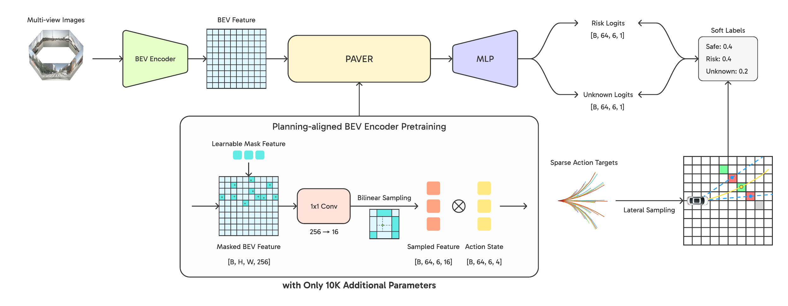

<div align="center">

# Planning-Aligned Pretraining of BEV Representations<br>with Sparse Action-Conditioned Targets<br>for End-to-End Autonomous Driving

[**Jaeha Song**](https://www.linkedin.com/in/archiiive99/) &nbsp;&middot;&nbsp; [**Soonmin Hwang**](https://soonminhwang.github.io/)<br>
Hanyang University

[**Project Page**](https://archiiive99.github.io/PAVER/) &nbsp;&nbsp; [**Model Zoo**](#model-zoo)

<a href="https://archiiive99.github.io/PAVER/">
  
</a>

</div>

PAVER pretrains a camera BEV encoder with sparse targets sampled along candidate
driving actions. A LiDAR sweep is used only to construct the pretraining targets.
The target builder and prediction head are discarded after pretraining, so
downstream training and inference remain camera-only.

The planned release includes training configurations, model adapters, evaluation tools,
and checkpoints for VAD-Tiny, VAD-Base, GenAD, and Bench2Drive UniAD-Tiny.

---

## News

> [!NOTE]
> **Code and checkpoints will be released soon.**
>
> The commands and repository layout below describe the planned release.
> Links to unreleased files lead to this notice until they become available.

## Overview

PAVER gives a shared bird's-eye-view (BEV) encoder a dedicated pretraining stage
before perception, prediction, and planning are trained together. Supervision
is placed along candidate ego motions rather than densely reconstructing the scene.

<div align="center">
  
</div>

*Sparse target construction and masked, action-conditioned BEV pretraining.*

1. **Construct sparse targets.** Roll out rule-based ego motions and query a
   single LiDAR sweep across the vehicle width. The fractions of occupied and
   unobserved query locations form the risk and unknown targets.
2. **Predict from masked BEV features.** Replace action-corridor features with
   a shared learnable token, then predict the two targets conditioned on the
   corresponding action state.
3. **Transfer only the encoder.** Discard the target builder and the
   **10K-parameter auxiliary head**, and fine-tune the original downstream model.
   No extra inference module or LiDAR input is added.

## Results

### Multi-task evaluation on nuScenes

Planning L2 and collision rate are averaged over 1, 2, and 3 seconds.
Values follow the main paper's multi-task comparison.

| Model | L2 (m) ↓ | Collision (%) ↓ | Motion ADE ↓ | Detection NDS ↑ | Map mAP ↑ |
| :--- | ---: | ---: | ---: | ---: | ---: |
| VAD-Tiny | 0.66 | 0.51 | 0.91 | 0.34 | 0.42 |
| + PAVER | **0.60** | **0.19** | **0.80** | **0.40** | **0.44** |
| VAD-Base | 0.74 | **0.31** | 0.76 | 0.42 | 0.50 |
| + PAVER | **0.56** | 0.40 | **0.69** | **0.45** | 0.50 |
| GenAD | 0.59 | 0.37 | 0.87 | 0.26 | **0.46** |
| + PAVER | **0.54** | **0.21** | **0.80** | **0.28** | 0.44 |

Bold marks a better value within each model pair at the displayed precision.
Planning L2 improves on all three backbones, but transfer is not uniform:
VAD-Base has a higher collision rate, and GenAD has lower map mAP.

### Closed-loop evaluation on Bench2Drive

| Model | Driving Score ↑ | Route Completion ↑ | Infraction Score ↑ |
| :--- | ---: | ---: | ---: |
| UniAD-Tiny | 48.45 | 60.96 | **0.85** |
| + PAVER | **58.79** | **79.06** | 0.79 |

Town05 Long uses nine routes with one repetition per route. PAVER improves
Driving Score and Route Completion, while Infraction Score decreases.

---

<a id="model-zoo"></a>

## Model Zoo

> ⏳ Checkpoints will be uploaded soon after review.

## Installation

```bash
git clone https://github.com/archiiive99/PAVER.git
cd paver
```

Follow [`docs/INSTALL.md`](#news) for the VAD environment and model
adapter setup. Dataset conversion is described in [`docs/DATA.md`](#news).

## Citation

```bibtex
@misc{song2026paver,
  title  = {Planning-Aligned Pretraining of BEV Representations with Sparse Action-Conditioned Targets for End-to-End Autonomous Driving},
  author = {Jaeha Song and Soonmin Hwang},
  year   = {2026}
}
```

## License

PAVER code and author-produced checkpoints are released under the
[Apache License 2.0](#news). Third-party components retain their original
licenses and notices in [`THIRD_PARTY_NOTICES.md`](#news).
